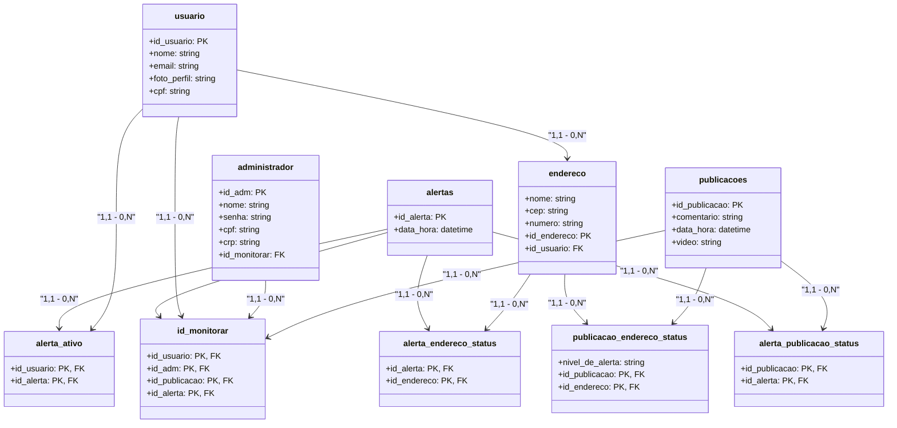

# 🌧️ AlertaRisk – Plataforma de Prevenção a Alagamentos
🚨 Monitoramento de zonas de risco e alertas para prevenir catástrofes causadas pelas chuvas.

## 📌 Introdução
O AlertaRisk é uma plataforma desenvolvida para prever e alertar sobre possíveis alagamentos em áreas de risco. Com base no volume de chuvas e dados geográficos.

Nosso objetivo é reduzir danos e salvar vidas, garantindo que as pessoas saibam o que fazer antes, durante e depois de uma emergência.

## ⚙️ Funcionalidades
### 🖥️ Página Inicial
- ✔️ Cadastro de usuários em áreas de risco
- ✔️ Envio de alertas via WhatsApp e SMS
- ✔️ Medidas preventivas e orientações de segurança
- ✔️ Contatos de emergência: SAMU, Bombeiros, Defesa Civil e Polícia Militar de Pernambuco

### 📌 Módulos do Sistema
- ✅ Cadastro e Login → Criar conta, fazer login e recuperar senha
- ✅ Mapa Interativo → Exibição de zonas de risco e alertas ativos
- ✅ Alertas em Tempo Real → Notificações sobre chuvas fortes e alagamentos
- ✅ Orientações de Segurança → O que fazer antes, durante e depois de um evento extremo

## 🛠️ Tecnologias Utilizadas
### 🚀 Back-end:

- Java
- Node.js

### 🎨 Front-end:

- HTML e CSS
- Javascript
- React.js

## Instalação

1. Clone o repositório:
```bash 
git clone https://github.com/victorhpmelo/AlertaRisk.git
```
2. Acesse a pasta do projeto:
```bash
cd AlertaRisk
```
3. Instale as dependências:
```bash
npm install AlertaRisk
```     
## Como usar

1. Inicie a aplicação:
```bash
npm start
```
2. Acesse o painel em: 
```bash
http://localhost:3006
```
3. Configure a área de monitoramento e visualize os alertas de risco.

## Modelagem de Dados



## Autores

Back-end:

- [Jorge Falcão](https://github.com/JorgeFalcao47)
- [Luana Marques](https://github.com/luanamarques0)
- [Matheus Alves](https://github.com/theualves)
- [Tarcilla Almeida]()
- [Victor Melo](https://github.com/victorhpmelo)

Front-end:

- [Cláudia Ribeiro](https://github.com/ClaudiaKRibeiro)
- [Evelyn Karoline](https://github.com/Evelynkaroline1)
- [Gabriel Ferreira](https://github.com/GabrielBielFerreira)
- [Maria Gabriella](https://github.com/mgabriiella)
